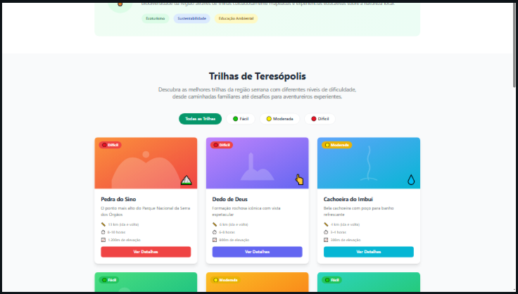
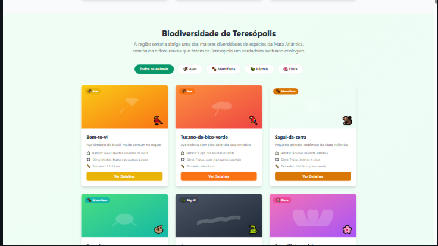

# 🌿 Circuito Terê Verde


**Integrante:** Leandro Bragança da Silva  

---

## 🏞️ Sobre o Projeto
O **Circuito Terê Verde** é um projeto de ecoturismo desenvolvido em **HTML, CSS e JavaScript**, com o objetivo de divulgar e valorizar as belezas naturais de **Teresópolis (RJ)**.  
O site apresenta informações sobre trilhas, parques e biodiversidade da região, incentivando práticas de turismo sustentável e a conscientização ambiental.

---

## 💡 Funcionalidades
- Página inicial com informações gerais sobre o projeto.  
- Página de **Trilhas** com descrições e níveis de dificuldade.  
- Página de **Biodiversidade & Eventos** com destaques e atividades locais.  
- Sistema de **Login Administrativo (demo)** com redirecionamento para o Painel Admin.  
- Layout **responsivo**, com paleta em verde e azul bebê.

## 📐 Prototipação

### Tela Inicial


### Tela Trilhas


### Tela Biodiversidade & Eventos


## 🗂️ Estrutura do Projeto
```
tereverde-online-mvp-frontend/
/index.html
/trilhas.html
/biodiversidade.html
/css/style.css
/js/main.js
/images/... (se houver)
```

## 🚀 Como Executar
1. Baixe ou clone este repositório:
   ```bash
   git clone https://github.com/Leandrosilva20/tereverde-online-mvp-frontend.git
   ```

2. Abra o arquivo `index.html` em qualquer navegador.  

3. Para testar o **login administrativo**:
   - **Email:** `admin@tere.com`  
   - **Senha:** `senha123`  

   > Se o login for correto, aparecerá o alerta “Acesso permitido!” e o usuário será redirecionado para o painel administrativo.

---

## 🖼️ Visual
O site utiliza um design moderno, com:
- Fundo verde e detalhes em azul bebê;  
- Layout limpo e minimalista;  
- Ícones e divisões para facilitar a navegação.  

---

## 👨‍💻 Tecnologias Utilizadas
- **HTML5**  
- **CSS3** (Flexbox e responsividade)  
- **JavaScript** (DOM e validação de login)  

[---](https://leandrosilva20.github.io/tereverde-online-mvp-frontend/)


## 📄 Licença
Projeto acadêmico desenvolvido por **Leandro Bragança da Silva**.  
Uso livre para fins educacionais.
